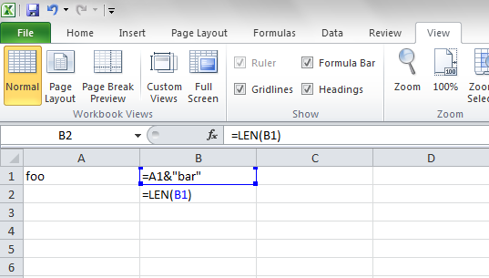
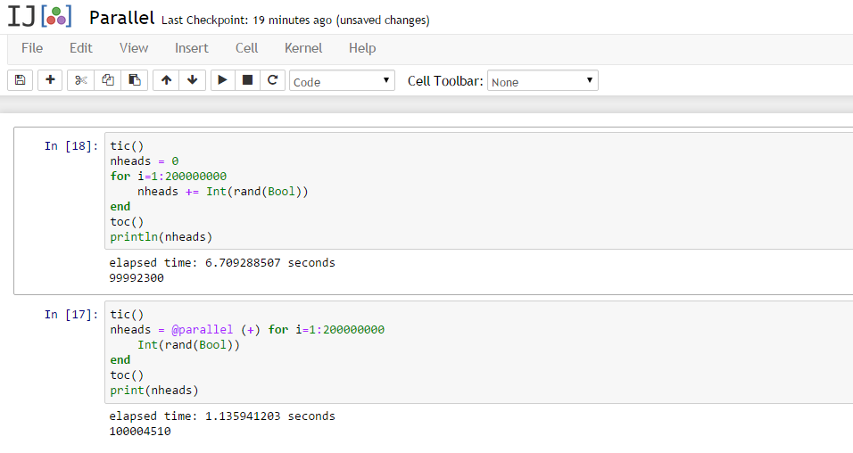

author:
  name: Tamas Foldi
  twitter: tfoldi
  url: http://databoss.starschema.net/
output: index.html
controls: true
theme: sjaakvandenberg/cleaver-light

--

# Going Functional
## Three programming languages what every data scientist should learn

--

# Why should I learn a new language?

--

### The three languages

**Clojure** Impure, Functional, Dynamically typed

**Haskell** Pure, Functional, Static typed

**Julia** Dynamic, Performance oriented

--

### What is "functional programming"?



-- 

### Functional Programming Buzz

* Functions, data = data, functions
* Lazyness
* Pure functions, immutable structures
* Concurrency
* Pipelining / Abstraction

-- 

# Clojure 

--

### List even numbers (Lazyness)

Initial version with simple collection.

```clojure
(filter
  even?
  (range 1 10))
```
Extending search on infinity sequence. 

```clojure
(take 10
  (filter
    even?
    (iterate inc 1)))

```

The `take` command _executes_ the `even?` and `iterate`.

--

### Threading macro (pipelining)

```clojure
(->> 101 
  (iterate inc) 
  (filter even?) 
  ; Filter for numbers having `modulo 5 = 0`
  (filter 
    (fn [x] (= 0 (mod x 5)))) 
  ; increase numbers with one
  (map inc)
  (take 10)
  (reduce +))

; result= 1560

```

--
### Lazy surprises - 1

```clojure
(defn lazy-test []
  (map (fn [val]
                (print " Value:" val)
                (* 2 val))
       [1 2 3 4]))

```
`lazy-test` returns doubled values. It prints also the 
original values (side effect).
```
user=> (lazy-test)
 Value: 1 Value: 2 Value: 3 Value: 4
(2 4 6 8)
user=>
```
-- 
### Lazy surprises - 2

We just want to return with `true` after processing.

```clojure
(defn lazy-test []
  (map (fn [val]
                (println "Value:" val)
                (* 2 val))
       [1 2 3 4])
       true)

```
```
user=> (lazy-test)
true
user=>
```

--

### Concurrent executions

```clojure
(defn long-running-job [n]
    (Thread/sleep 3001) ; wait for 3 seconds
    (+ n 10))

(time (doall (map long-running-job (range 4))))
; "Elapsed time: 11999.235098 msecs"
(10 11 12 13)

(time (doall (pmap long-running-job (range 4))))
; "Elapsed time: 3200.001117 msecs"
(10 11 12 13)
```

-- 

### Math/Stat Libraries & Framework


* **clojure.math** (java.lang.Math)
* **incanter** (based parallel colt, based on clhep)
* **Neanderthal** (ATLAS BLAS, optimized GPU engine)
* Jupyter kernel: **clojupyter**
* Gorilla REPL

--

# Haskell

-- 

### List Comprehension


```haskell
ghci> [x*2 | x <- [1..10]]  
[2,4,6,8,10,12,14,16,18,20] 
```
All right angle triangle within perimeter 50

```haskell
ghci> [ (a,b,c) | c <- [1..50], b <- [1..c], a <- [1..b], 
                 a^2 + b^2 == c^2, a + b + c <= 50 ]

[(3,4,5),(6,8,10),(5,12,13),(9,12,15),(8,15,17),(12,16,20)]
```

--

### Pattern matching & Tail recursion

Implementation of sum

```haskell
sum' :: (Num a) => [a] -> a  
sum' [] = 0  
sum' (x:xs) = x + sum' xs
```

Sum of integers between 1 and 10
```
*Main> sum' [1..10]
55
```

--

### Guards

```
bmiTell :: (RealFloat a) => a -> a -> String  
bmiTell weight height  
    | bmi <= skinny = "You're underweight"  
    | bmi <= normal = "You're supposedly normal."  
    | bmi <= fat    = "You're fat!"  
    | otherwise     = "You're a whale"  
    where bmi = weight / height ^ 2  
          skinny = 18.5  
          normal = 25.0  
          fat = 30.0  

```

--

### Fibonacci Numbers

Fibonacci numbers:

```haskell
fib = 0:scanl (+) 1 fib
```

First ten fibonacci numbers
```
ghci> take 10 fib
[0,1,1,2,3,5,8,13,21,34]

```

--

# Julia

--

### LLVM  

The world is betting on LLVM:
* **clang** is running on LLVM
* Google (the worlds biggest C++ shop) compiles its C/C++ code with LLVM
* Apple besides clang, **swift** using **OpenGL** JIT
* Sony PS4 is built around LLVM 

Julia generates *native machine code*, directly, the first time a function is run (`MCJIT`).

--


```
julia> code_native(+, (Float64, Float64))
Warning: Unable to find function pointer
ERROR: no method found for the specified argument types
 in code_native at reflection.jl:159

julia> 1.0 + 2.0
3.0
julia> code_native(+, (Float64, Float64))
        .text
Filename: float.jl
Source line: 120
        push	RBP
        mov	RBP, RSP
Source line: 120
        addsd	XMM0, XMM1
        pop	RBP
        ret
```
--


### Interoperability - python

call python's `math.sin` and julia `sin`:

```
using pycall
@pyimport math
math.sin(math.pi / 4) - sin(pi / 4)  # returns 0.0
```

call `scipy` or `numpy` works as well:

```
@pyimport scipy.optimize as so
so.newton(x -> cos(x) - x, 1)

@pyimport numpy.random as nr
nr.rand(3,4)

```

--

### Interoperability - c/fortran


```
julia> t = ccall( (:clock, "libc"), Int32, ())
2292761
```

```
function getenv(var::AbstractString)
  val = ccall((:getenv, "libc"),
              Ptr{UInt8}, (Ptr{UInt8},), var)
  if val == C_NULL
    error("getenv: undefined variable: ", var)
  end
  bytestring(val)
end
```

-- 



--

### Pipelines

FP like pipelining:

```
julia> [1:5;] |> x->x.^2 |> sum |> inv
0.01818181818181818
```


--

### Conclusions 

* if you need performance try **julia**
* if you are or think like a mathematican, try **haskell**
* if you have to get things done in enterprise environments, use **clojure**
* FP helps you to write shorter code with fewer errors
* pure functions are easy to test
* even if you stay with python or r additional languages help you to pick up new tricks and change your mindset

-- 

### Sources

* http://learnyouahaskell.com/
* http://tullo.ch/articles/python-vs-julia/
* https://www.juliabox.org/
* https://wiki.haskell.org/blow_your_mind
* https://github.com/stevengj/PyCall.jl
* http://docs.julialang.org/

